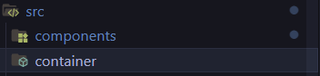
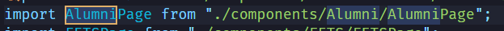
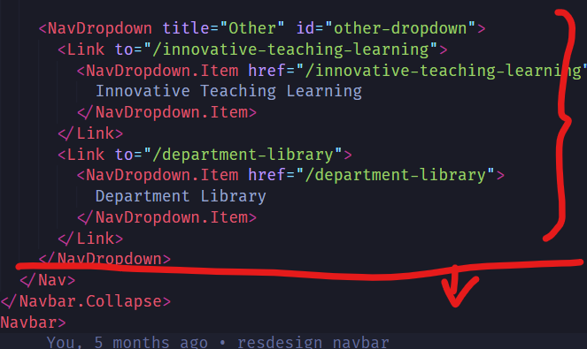

# EXTC Official Website

A simple React.js and Node.js based website for the Electronics and Telecommunication Department of Sardar Patel Institute of Technology.

## Installation

```bash
npm install
```

## Start Local Server

```bash
npm run start
```

## Make a Build Folder

```bash
npm run build
```

## Deploy to Github Pages

```bash
npm run deploy
```

## To change Navbar Items


NOTE THAT THE HOME PAGE CONTENT RESIDES IN about.js and slider.js both of which are in the containers folder. If unsure which content lies where check the URL routing from app.js and then topbar.js to find the respective component.

- Visit Topbar.js in src/components/Topbar.js

- For each item in the navbar, add a new Link tag with the path and name of the item
- For dropdown items use a NavDropdown tag and add a title and a list of items using NavDropdown.Item tags and direct them to the respective paths as seen in the image.
- Here Home and Vision & Mission are normal nav items and Academics is a dropdown item with 4 items in it.

Note that for every navbar items that you create, you need to include the path in the App.js file as well.

## To Add a new page

- Create a new component or container in the components or containers folder.


- Suppose you wanted to make a page called Alumni in the components folder, you would create a new file called `Alumni.js` and add React code like below. Do not forget to export the component at the end of the file. Refer other files in the components folder for reference.


- Import that component or container in `App.js`


- Add a new Route tag with the path and the component name in the same `App.js` as seen below. This means if the path is /alumni, the component Alumni will be rendered.


- Now the final path is adding a Nav link that directs the user to new page (in our scenario Alumni) in the `Topbar.js` file as seen in the image below.
- Add a new Link tag with the path and name of the item.


## To Add a new tab in Navbar



- Visit Topbar.js in src/components/Topbar.js
- For each item in the navbar, add a new Link tag with the path and name of the item below the existing items. You can also reorder the items as per your requirement to move them left or right in the navbar.

## To Add new timetables/syllabus


- All PDFs of timetables and syllabus are present under `src/pdfs` folder. Visit the respective folder (like Btech, Mtech, etc) and add the PDFs there with a proper name.
- Now visit the respective React component (like Btech.js, Mtech.js, etc) in the containers folder. Assuming you want to add a PDF for Btech, visit Btech.js.


- Copy paste one of these import statements and rename the PDF file name as per your requirement. Note that the file name should be the same as the one you added in the pdfs folder.


- Use the same file name you imported above in a li tag with a href and target as _blank in the render method of the component. This will create a new tab in the respective page with the PDF.


## Styling

Styling can be changed by visiting the respective component folder and changing the CSS file. For example, if you want to change the styling of the FETs page, visit FETS.css in the components folder and change the CSS as per your requirement. To find files faster use shortcut Ctrl + P and type the file name.

## Credits

Developed by **ATHARVA SHAH** & **ISHANI MATHUR** For EXTC Department, Sardar Patel Institute of Technology in Academic Year 2024-25.

For any documentation related queries, contact Atharva Shah (<highnessatharva@gmail.com>) or Ishani Mathur (<mathurishani13@gmail.com>).
